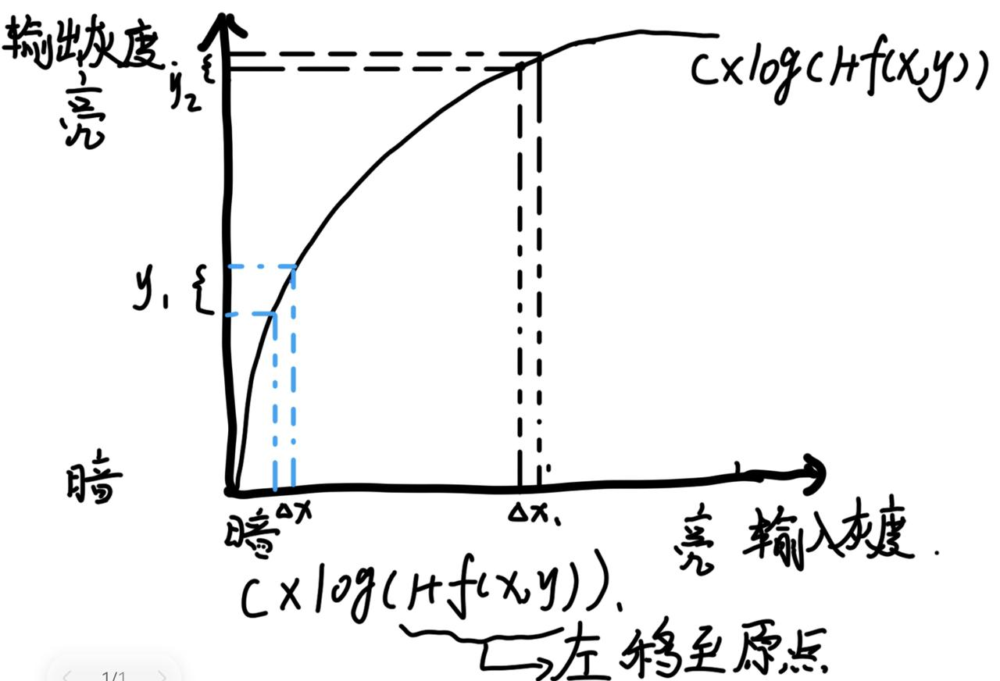
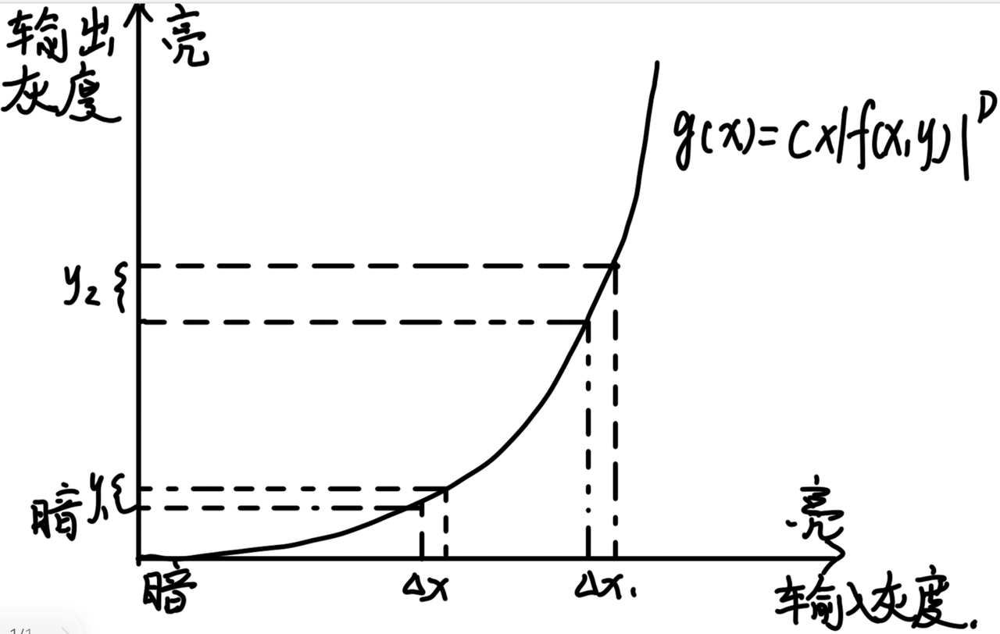
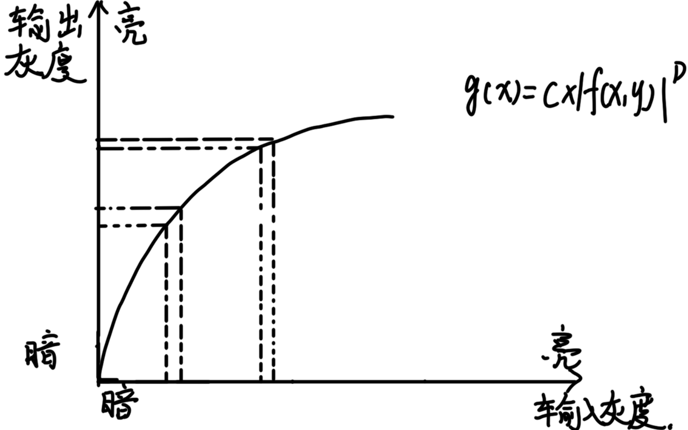

# 前言
在了解了数字图像处理的基础概念之后，在这一章我们将会学习到两个非常重要的图像增强方法：空间域图像增强与频率域图像增强方法。
# 空间域图像增强
## 空间域
在上一节当中，我们说明了数字化图像的取样，将一张连续的数字图像变成离散的像素形式。这时，如果我们对图像建立直角坐标系，就会发现，图像上的一个个像素，可以通过坐标来表示其具体位置，即一个个像素变成了坐标轴上的一个个点。那么，当我们研究像素之间的关系的时候，是不是就是研究坐标轴上点的关系？那坐标轴上点的关系，我们就可以用函数来表示，点的关系出来之后，像素之间的关系也就出来了，我们就可以利用像素之间的关系，对图像进行处理了。
空间域的概念也由此而来，将图像看成一个二维矩阵，并且直接对空间中的像素进行操作。通过行（x）与列（y）的数值来确定像素的位置，如像素 f（0，0）代表位于原点的像素。
## 空间域增强方法
### 1.灰度变换法
#### 1.1.线性灰度变换
原理：
      
这是一种简单的灰度变换方法，它基于线性函数来改变图像的灰度范围。通过调整图像的灰度范围，可以改善图像的对比度和亮度。假设原图像的灰度范围是$[a,b]$，想要将其拉伸或压缩到新的范围$[c,d]$，其变换函数为$$g(x,y)=\frac{d - c}{b - a}[f(x,y)-a]+c$$
      
举个例子：
      
一张看起来比较暗的图片当中（如灰度为0\~128），我们可以通过线性灰度变换将其拉伸到灰度为0\~255的范围当中来，通过拉高原图像的灰度，来让图像当中更多看不清楚的细节表现出来。
### 2.非线性灰度变换
#### 2.1.对数变换
原理：

对数变换的函数形式为$$g(x,y)=C\times\log(1 + f(x,y))（C为常数）$$
它主要用于压缩图像的动态范围。当图像的灰度值分布很宽，例如在处理高动态范围的图像（如 HDR 图像）或者图像的亮度变化非常剧烈的情况时，对数变换可以使图像的低灰度值区域的细节更加明显。

图中可以非常明显的看到，暗的区域输出灰度明显比亮的输出灰度增长的多。这个特性可以应用在天文学家处理星云图的时候，将恒星的亮度拉低，将暗处的星云细节放大，增加星云图上的细节。
#### 2.2.幂次变换
原理：

幂次变换的函数形式为
$ g(x,y)=C\times f(x,y)^D （C和D为常数）$
当D>1时，图像的高灰度值区域会被拉伸，图像变亮，对比度增强；

当D<1时，图像的低灰度值区域被拉伸，图像变暗，低灰度区域的对比度增强。

### 3.空间滤波法
空间滤波法的基本原理是，利用像素与其邻域内像素的关系来进行增强。通过定义一个滤波器（掩模或窗口），在图像上滑动这个滤波器，对每个像素进行处理。下面介绍两种滤波方法。
#### 3.1.平滑滤波
原理：

平滑滤波主要是为了减少图像中的噪声。它是基于图像中像素与其邻域像素的关系来进行操作的。

例如均值滤波器，它是一种线性滤波器。对于一个$n\times n$（如2*2）的均值滤波器，其滤波器系数都是$\frac{1}{n^{2}}$。

当它在图像上滑动时，以当前像素为中心的$n\times n$邻域内的像素灰度值相加后取平均值，作为新的当前像素的灰度值。

设其滤波器系数都为$\frac{1}{n^{2}}$，新的像素灰度值$g(x,y)$的计算公式为：
      $$g(x,y)=\frac{1}{n^{2}}\sum_{i = - \frac{n - 1}{2}}^{ \frac{n - 1}{2}}\sum_{j = - \frac{n - 1}{2}}^{ \frac{n - 1}{2}}f(x + i,y + j)$$
      
平滑滤波可以用在去除照片当中的椒盐噪声（即照片当中会有随机的黑白色像素点，看起来跟食物上撒上椒盐一般），但是缺点就是给相邻的像素点取平均值，容易使得边缘的像素值变化变缓，造成视觉上的边缘轮廓变得模糊。
#### 3.2.锐化滤波
原理：

锐化滤波用于增强图像的边缘和细节。它是基于图像的一阶或二阶导数来实现的。例如拉普拉斯算子，它是一种二阶导数算子。对于离散的数字图像，拉普拉斯算子的一种具体的形式是:
      $$ \nabla^{2}f(x,y)=f(x + 1,y)+f(x - 1,y)+f(x,y + 1)+f(x,y - 1)-4f(x,y)$$
当将这个算子应用于图像时，边缘部分的像素灰度值会发生较大变化，相当于取出了轮廓，通过适当的增强处理，例如将原图像与拉普拉斯算子处理后的图像相加，让轮廓的灰度值在原来的基础上增加，可以使图像的边缘更加突出。
## 频率域
这一章节需要有信号与系统基础，没有基础的小伙伴记得去补充一下呀~！

频率域是从信号处理的角度来描述图像的一种方式。在频率域中，图像被看作是不同频率成分的组合。就像声音可以通过傅里叶变换分解为不同频率的波一样，图像也可以按照此方法，将其分解为不同频率的波。在一幅图像当中，其低频成分对应图像中变化缓慢的区域，如大面积的背景。高频成分则对应图像中变化剧烈的部分，如边缘和细节，而图像分解出来不同波的振幅，则可以理解为灰度值的大小。

**傅里叶变换的作用：**

通常使用傅里叶变换将图像从空间域转换到频率域。二维离散傅里叶变换（DFT）公式为$$F(u,v)=\sum_{x = 0}^{M - 1}\sum_{y = 0}^{N - 1}f(x,y)e^{-j2\pi(\frac{ux}{M}+\frac{vy}{N})}$$
其中$f(x,y)$是空间域的图像，$M$和$N$是图像的尺寸，$u$和$v$是频率域的变量，$j=\sqrt{-1}$。

通过这个变换，我们可以得到图像在频率域的表示$F(u,v)$，它描述了图像中每个频率成分的强度。从直观上理解，傅里叶变换后的频谱图中心部分（低频区域）通常代表如图像的背景，这一缓慢变化的部分，而远离中心的部分（高频区域）代表图像的边缘和细节。
#### 频率域增强方法的内容
##### 低通滤波
原理：

在频率域中，低通滤波器的作用是滤除高频成分，留下低频成分通过。图像中的噪声或者模糊图像通常包含较多的高频成分，所以通过滤除高频成分的噪声与模糊来对图像进行处理。

理想低通滤波器示例：

理想低通滤波器的传递函数为$$H(u,v)=\left\{\begin{matrix}1, & D(u,v)\leq D_{0}\\ 0, & D(u,v)>D_{0}\end{matrix}\right.$$
其中$$D(u,v)=\sqrt{u^{2}+v^{2}}$$ 是频率域中的点$(u,v)$到原点的距离，$D_0$是截止频率。

当$D(u,v) \leq D_{0}$时，$H(u,v)$近似为1，滤波器允许该频率成分通过，不做改变；当$D(u,v) \geq D_{0}$时，分母数值变大，$H(u,v)$近似为0，滤波器将该频率成分完全截断。这样，我们就能通过设置截止频率，去除图像中的高频噪声。只不过图像当中的边缘和细节也属于高频成分，被滤除了一部分，也会变得模糊。

在实际生活当中，由于老照片会有一些白点，当我们上传老照片变成数字图像的时候，上面容易有高频分量造成的椒盐噪声，此时选用低通滤波器，能够很好的滤除高频分量所造成的椒盐噪声。
##### 高通滤波
原理：

与低通滤波相反，高通滤波器$H(u,v)$用于增强高频部分，减弱低频部分。其主要目的是突出图像的边缘和细节，因为边缘和细节在频率域中主要对应高频成分。

巴特沃斯高通滤波器示例：

巴特沃斯高通滤波器的传递函数为$$H(u,v)=\frac{1}{1 + (\frac{D_{0}}{D(u,v)})^{2n}}（n是滤波器的阶数）$$

当$D(u,v)=\sqrt{u^{2}+v^{2}}$较小（低频部分），$H(u,v)=\sqrt{u^{2}+v^{2}}$的值较小，对低频成分进行衰减；

当$D(u,v)=\sqrt{u^{2}+v^{2}}$较大（高频部分），$H(u,v)=\sqrt{u^{2}+v^{2}}$的值较大，对高频成分进行增强。通过调整截止频率$D_0$和阶数$n$，能够有效控制滤波器对高频成分的增强和对低频成分的衰减。

实际应用：在指纹识别过程中，由于指纹很细，而且拍摄出来的图片对比度不高，我们可以采用高通滤波器，滤除低频分量，使得图像当中的指纹更加明显，便于我们后续的处理。