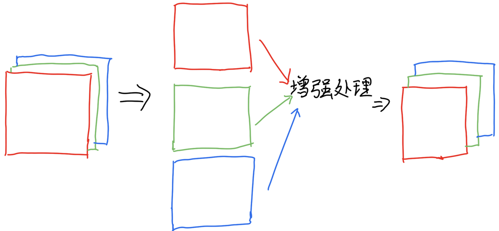

# 前言
在这一章我们将会介绍到彩色模型，彩色图像的处理，以及压缩的内容。只不过不用担心，里面有相当一部分的知识是与灰度图像对称的~！
# 彩色模型
## RGB 模型
  RGB（红、绿、蓝）模型是最常用的彩色模型，它与我们人眼感知色彩的原理一致。在这个模型中，我们把每种颜色看成由一个\[R，G，B]三维向量构成的，其中R，G，B三原色为向量的基底（RGB三通道通常取值均为0\~255）。通过不同强度的红、绿、蓝三种基色来叠加出各种颜色。例如，在电视屏幕中，通过控制电子枪发射的红、绿、蓝光束的强度就可以显示我们看到的各种颜色。
## CMYK 模型
  CMYK（青、品红、黄、黑）模型主要用于印刷行业。与 RGB 模型相反，它是一种减色模型。主要应用在印刷当中，通过使用青（C）、品红（M）、黄（Y）三种颜料进行色料相加与色料相减，从而产生所需的颜色。为了避免与蓝色（Blue）混淆，黑色使用K。理论上三原色等量混合后会产生黑色，但是由于CMY三色混合之后只能产生灰色，所以引入黑色来弥补不能混合成黑色的缺点。
## HSI 模型（色调、饱和度、亮度）
  HSI 模型通过色调，饱和度，强度来描述物体颜色。色调（H）表示颜色的种类，如红色、绿色等，取值范围一般为：0°\~360°。饱和度（S）表示颜色的纯度，饱和度越高，颜色越鲜艳，通常取值范围为0\~1。亮度（I）表示颜色的明亮程度，亮度取值越高颜色越亮，通常取值范围为0\~1。
# 彩色图像处理
## 彩色图像的灰度化
  将彩色图像转换为灰度图像是一种常见的操作，最常用的是加权平均法。根据人眼对不同颜色的敏感度，通常用公式$Y=aR+bG+cB$(其中a+b+c=1，a、b、c为各自代表颜色的权重)来计算灰度值，其中R、G、B是彩色像素的红、绿、蓝。
  如：$$Y=0.278R+0.563G+0.159B$$
  在一些对颜色信息要求不高的图像分析任务，如边缘检测、物体形状识别等，将彩色图像灰度化能够减少计算量并且简化分析过程。
## 彩色图像的增强
  这里以RGB三通道图像作为例子，进行说明图像增强的底层逻辑。在实际图像当中，RGB三通道类似上下层的关系，我们从顶层看下去看到他们三张单一的红绿蓝颜色图所叠加出来的颜色。既然他们是三张单一的颜色图，那我们就可以把三张单一的颜色图给抽出来，看成是灰度图，分别对三张图片进行一模一样的操作，最后将操作完的三张图片再按原来的顺序放在一起，这样就能实现对彩色图像的增强了。

### 空间域增强：
  与灰度图像类似，可以在空间域对彩色图像直接进行增强处理。例如，对每个颜色通道分别进行灰度变换操作，如线性拉伸、非线性变换（对数变换、幂次变换等）来调整每个通道的对比度和亮度。
### 频率域增强：
  首先将彩色图像的每个通道分别使用傅里叶变化转换到频率域，然后在频率域应用滤波器（如低通滤波器、高通滤波器）进行增强，最后再将每个通道通过傅里叶逆变换转换回空间域，再组合成彩色图像。
## 彩色图像的分割
  1. **基于阈值的分割：**根据某一个或者多个需要的特性来设定阈值，将图像分割成不同的区域。举个例子，我们需要在海边落日的图像中分割出火烧云与大海，我们可以选择HSI模型，将火烧云的阈值设置在0°\~60°，300°\~360°时划分为火烧云，剩下的则划分为为海面，
  2. **聚类算法分割：**K - Means 聚类算法也可以用于彩色图像分割。它将图像中的像素根据颜色特征划分为不同的聚类。前面我们将RGB模型当中的颜色表现看成一个三维空间当中的向量，那么颜色就可以看成一个在三维空间的点，这时候图像上的所有像素的颜色，都可以映射到三维空间当中，这时候为我们就可以通过聚类算法来将这些点进行聚类并且不断的迭代，直到满足一定的收敛条件，使得点完全聚类好，这时候再把聚类完成后区域内的点映射回去，我们就能得到分割完成的图像了。
## 彩色图像的压缩
  这一节具体内容将会在后面章节提及~！
  1. 无损压缩：无损压缩方法能够在不损失图像任何信息的情况下减少图像的数据量。
  2. 有损压缩：有损压缩方法通过牺牲一定的图像质量来获得更高的压缩比。